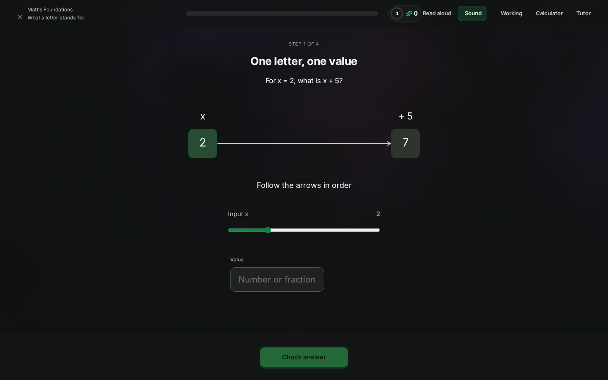
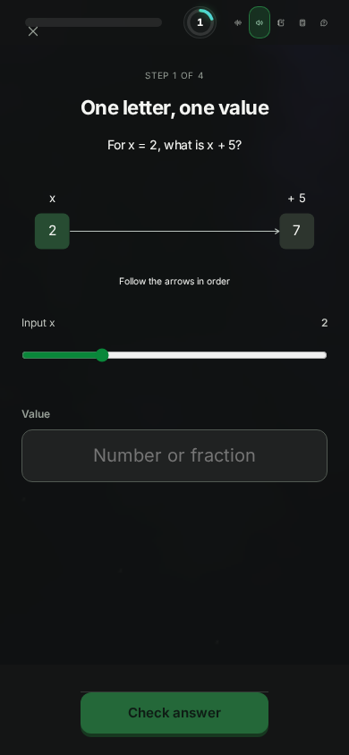

# How a Discere lesson should be delivered

Status: accepted direction, 6 October 2026. Phases 0–2 are implemented; see [Implementation status](#12-implementation-status).
Prompted by: George's review of Maths Foundations, "What a letter stands for", step 1 of 4.
Supersedes, once accepted: the "question first" lesson grammar in
[product-goal-and-library-roadmap.md](../product-goal-and-library-roadmap.md) §1 and the "Learning
behavior" section of [brilliant-experience/README.md](../brilliant-experience/README.md). Neither file
has been edited.

George's complaint, quoted: "why is that in big bold letters and what was the actual lesson? this is
the first panel of that course, is that really how you want to introduce maths?"

He's right, and the problem goes deeper than the heading's font size. The first screen of the first
course doesn't teach anything. It shows its own answer, and the explanation it was written around never
reaches anyone who answers correctly. Each of those faults has a specific cause in the code or the
content, listed in section 1. Section 2 covers what Brilliant, Khan Academy and the research suggest
doing instead. Sections 3 to 8 are the specification.

---

## Contents

1. [Diagnosis: why the current first screen fails](#1-diagnosis-why-the-current-first-screen-fails)
2. [What the evidence says](#2-what-the-evidence-says)
3. [Lesson anatomy](#3-lesson-anatomy)
4. [Screen layout and typography](#4-screen-layout-and-typography)
5. [Course openings](#5-course-openings)
6. [The lesson workspace: working, calculator, tutor](#6-the-lesson-workspace-working-calculator-tutor)
7. [Content schema changes and migration](#7-content-schema-changes-and-migration)
8. [Exemplar: Maths Foundations lesson 1, rewritten](#8-exemplar-maths-foundations-lesson-1-rewritten)
9. [The pattern in three other courses](#9-the-pattern-in-three-other-courses)
10. [Path](#10-path)
11. [Sources](#11-sources)
12. [Implementation status](#12-implementation-status)

---

## 1. Diagnosis: why the current first screen fails

Captured from a fresh local database on 6 October 2026 (mock tutor, images off):

| | |
|---|---|
|  |  |
| Desktop 1440×900 | Phone 390×844 |

After answering 7: [correct state](screens/current-maths-l1-step1-correct-1440.png). With the
workbench open: [calculator beside x + 5](screens/current-workbench-calculator-1440.png). Where the
lesson's goal currently lives: [roadmap tray](screens/current-maths-roadmap-1440.png). The same pattern
in other courses: [Physics lesson 1](screens/current-physics-l1-step1-1440.png),
[Economics lesson 1](screens/current-economics-l1-step1-1440.png).

### 1.1 The biggest text on the screen is a label the author wrote for themselves

`StoryStageView.tsx` renders the step's `heading` block as the page's `<h1>`, so "One letter, one
value" gets the largest type on the screen. It's a summary of a conclusion the learner hasn't reached
yet, so at that moment it means nothing. The question, which is the thing to do, is set smaller beneath
it. The lesson title ("What a letter stands for") appears only as 13 px text in the header, and on a
phone `StageHeader` hides it altogether. The only statement of what the lesson is for is its
`orientation` ("Say what a variable is and is not, and check a proposed solution by substituting it
back."), and that appears only in the roadmap tray before Start, written like a syllabus objective.

The whole corpus does this. 900 of the 945 steps start with a `heading` block.

### 1.2 The teaching paragraph is deleted before the learner sees it

The bundle does contain teaching. Step 1 has a 41-word paragraph ("The machine adds 5 to the value you
choose for x. … A letter lets us describe the same calculation for many possible inputs."). But
`learnerSteps()` in `apps/server/src/content.ts` sends a question-led step to the browser with its
heading blocks only. Every step with a question in an active course is question-led, so every
paragraph is held back until after an answer.

After an answer, the paragraph is reachable only through `QuestionFeedback`: **Why?** → worked answer
→ **Explore the idea** → paragraph. If the learner is right, both of those are optional clicks. So the
correct learner, which here means nearly everyone because of 1.3, never reads the one sentence that
says what a letter is. The lesson's idea is never delivered. That's what George means by "what was the
actual lesson?"

### 1.3 The diagram shows the answer

`NumberMachine` in `LearningDiagram.tsx` computes and draws the output live from the slider, which
starts at x = 2. It ignores `showResults`. So before any answer the screen already shows `2 → +5 → 7`,
in green, under the question "For x = 2, what is x + 5?". The question asks nothing that the screen
doesn't already state. `EquationBalance` behaves the same way.

Six diagram types ignore the reveal flag: `number_machine`, `equation_balance`, `coordinate_plane`,
`truth_table`, `program_trace` and `search_array`. They sit under 80 graded steps across Maths,
Logic and Computer Science. Not all of those 80 necessarily leak, but nothing stops them.

### 1.4 The question tests arithmetic, not the idea

"For x = 2, what is x + 5?" can be answered by an adult who has never heard of a variable, because
"x = 2" tells them to replace x. What the lesson exists to change is the belief that a letter in maths
is mysterious, and this question doesn't touch it. It isn't a pretest of the lesson's concept. It's a
warm-up sum with the result printed beside it.

### 1.5 The lesson's later steps teach the next two lessons' content without saying so

The lesson then asks:

- step 3, "Which x makes x + 5 = 12 true?", with the hint "Undo the addition of 5 on both sides" (that
  is lesson 2, *Keeping the balance*);
- step 4, "Which x makes 3x − 4 = 14 true?", with "Undo the final subtraction before undoing
  multiplication" (that is lesson 3, *Undoing in the right order*);
- practice 1, "Solve x / 2 + 1 = 4".

So a lesson about what a letter means grades the learner on solving two-step equations, a method it
never teaches. Step 2 is authored as a `worked_example`, but it is played as a cold question ("Why
does x = 3 fail here?"). The player never reads `step.kind`, and no example is ever worked in front of
the learner.

### 1.6 Question-first is applied whether or not the learner can reason to an answer

The roadmap made "question, diagram, response, earned explanation" the grammar for every step. That
works when the learner can get somewhere by reasoning from what they already know. It fails when the
question depends on a word, symbol or convention they haven't met. The first lessons of other courses
show the problem:

- Physics lesson 1 asks for a "displacement in metres". The definition of displacement exists only in
  the hidden paragraph.
- Economics lesson 1 asks how many chairs a table "costs". Opportunity cost is defined only in the
  hidden paragraph, which also contains the worked answer "60 ÷ 20 = 3".
- Calculus lesson 1 asks "what value does f(x) approach". The hidden paragraph is the definition of a
  limit.

In each case the learner guesses or computes something before being told what it means. Section 2.3
covers why the research says this is the wrong order for a novice.

### 1.7 Every control competes for attention

The header carries the course, the lesson, a progress bar, a combo ring, an XP count, Read aloud,
Sound, Working, Calculator and Tutor. That's ten things before the lesson begins. Below them, the slider
labelled "Input x" and the answer box labelled "Value" are two inputs for one answer, and nothing says
which one counts. The scientific calculator is offered beside "2 + 5".

### Summary

| Fault | Cause |
|---|---|
| Wrong thing is biggest | heading block → `<h1>`; lesson title hidden on phones |
| No lesson | paragraphs stripped in `learnerSteps()`; explanation hidden behind Why? → Explore |
| Answer visible | six diagram types ignore `showResults` |
| Question tests nothing | authored against arithmetic, not the concept |
| Scope creep | lesson 1 grades lessons 2–3's method; `worked_example` played as a question |
| Wrong order for novices | question-first applied to new vocabulary and notation |
| Clutter | ten header controls; two inputs for one answer; calculator on every question |

---

## 2. What the evidence says

### 2.1 Brilliant

**Observed** on 6 October 2026, from public pages loaded in headless Chromium with no account:

- *Solving Equations* (Pre-Algebra) lists 68 lessons and 1,099 exercises in levels. Level 1 is
  "Introduction": *Finding Unknowns*, *Equations with Unknowns*, *Building Expressions*, *Working
  with Unknowns*, then a *Level Check*. Level 2 starts the *Solving by Substitution* methods. The
  course doesn't open on notation. It opens on finding an unknown, and the word "equation" first
  appears in the second lesson title. ([course page](https://brilliant.org/courses/pre-algebra/solving-equations/))
- Clicking Start on a lesson while signed out goes to an onboarding flow. That flow uses the lesson
  player's chrome: a back arrow, a segmented progress bar across the top, a sound toggle, **one bold
  sentence centred as the only headline**, a single interactive below it (for example a drag-the-tiles
  expansion of (x + 4)(x + 2) beside the tutor character, under "I'm here to help if you ever get
  stuck."), and one full-width **Continue** at the bottom. There's no step title, no XP and no tool
  bar.
- The public K–5 practice page ("Count with ten frames") puts a small eyebrow ("Problem 1 of 15")
  above **the question as the headline**, then the figure, then the answer choices in a tinted panel
  directly beneath it. A wrong answer shows a short visual hint and "Try again" (also recorded in
  [brilliant-experience](../brilliant-experience/README.md)).
- An authenticated lesson was not reached, because that needs an account. Nothing below claims to
  have seen one.

**Stated by Brilliant** (accessed 6 October 2026):

- "Each lesson focuses on a single concept and has a mix of direct instruction and blocked problem
  solving." "We pretest on the material, letting the learner try to find a solution before learning
  the procedure." Feedback is "instant, custom feedback based on your answer". The design starts by
  "minimizing cognitive load" and "starting with the simplest version of an idea", and "good tutoring
  makes itself unnecessary." ([About](https://brilliant.org/about/))
- A typical lesson is "about 5 interactive problems plus a 3-problem skill check". "Students use a
  visual model before translating the idea into symbols", and they "test examples and notice why the
  rule works". ([How Brilliant fits into a math lesson](https://brilliant.org/help/schools-and-educators/how-brilliant-fits-into-a-math-lesson/))
- *Solving Equations* proves "you already know algebra" with puzzles solvable "with simple reasoning
  alone". Each lesson starts "with a problem that is right on the edge of your understanding",
  needing "just one small mental leap". Only after that, "once you've built up an intuitive arsenal
  of problem-solving techniques, we introduce them to the algebraic names of those techniques."
  ([Brilliant blog, Solving Equations](https://blog.brilliant.org/solving-equations/))
- Authors own "the learning objective, the progression, and the 'aha moment'". A course needs "a
  difficulty ramp" and "enough edge cases to test their understanding". "A single wrong problem can
  shake a learner's confidence." ([Hand-crafted, machine-made](https://blog.brilliant.org/hand-crafted-machine-made/))
- Koji, the tutor, "can see exactly what you're working on — including the interactive elements on
  screen" and "guides you through the thinking step by step, without ever just giving you the
  answer" ([How does Koji work](https://brilliant.org/help/features/how-does-koji-work/)). It "offers
  more help when you're learning a new topic, and steps back when it's time to test your knowledge"
  ([A world-class tutor in every home](https://blog.brilliant.org/a-world-class-tutor-in-every-home/)).

**Inferred.** Brilliant's pretest is about something the learner can already reason about: a balance
scale, or fruit on a scale. It isn't about vocabulary. The name arrives after the doing, as a label
for something the learner has already done. Discere copied the "question before explanation" order
but not that condition. The headline in Brilliant's player is a full sentence addressed to the
learner, never a section label. Brilliant's own description says "a mix of direct instruction and
blocked problem solving", so lessons there contain direct teaching as well as problems.

### 2.2 Khan Academy

Sources were accessed on 6 October 2026. Khan's support articles return 403 to automated fetching, so
some points below come from search-result extracts of those pages, and are marked as such.

- **Lesson shape.** A unit holds lessons. Each lesson pairs a short video or article with a practice
  exercise. The algebra foundations video *Evaluating an expression with one variable* opens on a
  real situation: a raffle where tickets cost 5t + 3. The letter arrives as a way of describing
  something concrete. ([video](https://en.khanacademy.org/math/algebra/x2f8bb11595b61c86:foundation-algebra/x2f8bb11595b61c86:intro-variables/v/variables-and-expressions-1))
- **Hints become a worked example.** "If you view all the hints you get … a 'worked example'".
  Learners are told to try first if a problem looks familiar, ask for a hint straight away if it
  doesn't, and "explain the step or the reasoning to yourself in your own words."
  ([How should people practice on Khan Academy?](https://blog.khanacademy.org/how-should-people-practice-on-khan-academy/))
  Using a hint marks the item wrong for mastery (support community, via search extract).
- **Mastery.** Skills move through Attempted, Familiar, Proficient and Mastered, worth 50, 80 and 100
  mastery points, through exercises, quizzes, unit tests and course challenges. You reach Proficient
  on an exercise by getting everything right, or by getting one wrong and then answering a bonus
  question correctly. (Support centre, via search extracts:
  [self-paced mastery](https://support.khanacademy.org/hc/en-us/articles/360007253831-What-is-self-paced-Mastery),
  [earning Proficient](https://support.khanacademy.org/hc/en-us/articles/35916723756685-How-does-a-student-earn-Proficient-on-a-practice-exercise).)
- **Scratchpad and calculator.** There's a "show scratchpad" drawing area beneath the question. A
  calculator is attached to particular quizzes, tests and questions where it's allowed, and isn't
  offered in the "Check your understanding" questions inside articles (support community, via
  search extract:
  [calculator in check-your-understanding](https://support.khanacademy.org/hc/en-us/community/posts/4408419369997-Calculator-in-Check-Your-Understanding-sections)).
  So the calculator is a per-question policy, not a global tool.
- **Reimagined Khan Academy (2025–26).** Students said the old site felt "overwhelming or boring"
  and that they weren't "always sure what to work on next". The response was a learner queue, unit
  missions, and AI tutoring "built into practice, not separate from it".
  ([What's changing for students](https://support.khanacademy.org/hc/en-us/articles/46056261189773-What-s-changing-for-students-on-the-reimagined-Khan-Academy),
  [Built in the open](https://blog.khanacademy.org/built-in-the-open-how-pilot-districts-shaped-the-reimagined-khan-academy/))

### 2.3 Duolingo, for session shape only

Lessons take a few minutes. New material appears "in sentences made up of only familiar words and
grammar, plus the specific new thing", and exercises go from recognition, to constrained production,
to free production ([Duolingo, right level of difficulty](https://blog.duolingo.com/right-level-of-difficulty);
summary via [screensdesign showcase](https://screensdesign.com/showcase/duolingo-language-lessons)).
For Discere: one new thing per screen, surrounded by familiar things, and recognise before produce.

### 2.4 Learning science

| Finding | What it means for Discere | Source |
|---|---|---|
| **Worked-example effect.** Novices learn more from studying worked solutions than from solving the same problems unaided. | Real worked examples, actually shown, early in each lesson. | Sweller & Cooper 1985; Atkinson, Derry, Renkl & Wortham 2000 |
| **Fading.** Remove worked steps one at a time (example → completion problem → independent problem) instead of switching straight from examples to problems. | `worked_example` → `faded_example` → `try` → `transfer`. | Renkl & Atkinson 2003 |
| **Example–problem pairs** beat problem-only sequences. | Each `try` follows an example of the same structure. | van Gog, Kester & Paas 2011 |
| **Self-explanation.** Prompting learners to explain steps improves understanding. | One "why does this step work?" prompt per worked example. | Chi et al. 1994 |
| **Expertise reversal.** Help that serves novices hinders more expert learners, and the reverse. | Explain-first for new notation and terms. Ask-first once the learner has something to reason with. Faster routes for learners who pass a placement. | Kalyuga, Ayres, Chandler & Sweller 2003 |
| **Productive failure / problem solving then instruction (PS-I).** Overall d ≈ 0.36 on conceptual understanding and transfer, without losing procedural knowledge. Stronger for older learners. Works when the problem activates prior knowledge, uses contrasting cases, and the instruction that follows builds on the learner's attempts. | Ask-first is right when those conditions hold and wrong when they don't. The explanation must refer to what the learner just did. | Sinha & Kapur 2021; Loibl, Roll & Rummel 2017; Schwartz & Bransford 1998 |
| **Pretesting / prequestions** improve later learning of the prequestioned material, even when the first answers are wrong, *provided the teaching follows*. | A prediction is low-stakes and ungraded, and it is always followed by the teaching. It isn't evidence of mastery. | Richland, Kornell & Kao 2009; Pan & Carpenter 2023 |
| **Pre-training.** Learning the names and behaviour of the parts first makes the main explanation easier to process. | Introduce a term or symbol before any question that depends on it. | Mayer, Mathias & Wetzell 2002 |
| **Concreteness fading.** Go from concrete, to an iconic idealisation, to the abstract symbol. | Words ("a number plus 5"), then a box ("☐ + 5"), then the letter ("x + 5"). | Fyfe, McNeil, Son & Goldstone 2014 |
| **Retrieval practice / testing effect.** | End-of-lesson skill check without scaffolds, plus delayed recall. Discere already has the delayed recall. | Roediger & Karpicke 2006; Dunlosky et al. 2013 |
| **Split attention / spatial contiguity.** Related words and pictures should be integrated, not separated. The effect is strongest for complex material. | Labels inside the figure. Teaching text directly above the figure it describes. Prompt directly above its answer. No caption floating apart from what it names. | Ginns 2006; Schroeder & Cenkci 2018 |
| **Redundancy and coherence.** Don't repeat the same information in several forms, and remove decoration. | No step title restating the prose. No "Follow the arrows in order" caption. No second input for one answer. | Sweller, van Merriënboer & Paas 2019; Mayer & Moreno 2003 |
| **Signalling.** Cues that highlight the essential organisation help. | One headline per screen, and it is the sentence that matters. Highlight the part of the figure the text is talking about. | Mayer & Fiorella, in Mayer 2017 |
| **Segmenting.** Learner-paced segments beat continuous presentation. | One idea per screen, a Continue between screens, and at most about 60 words of prose before an interaction. | Mayer 2017 |
| **Curiosity as an information gap.** Curiosity rises when a learner knows enough to notice what they don't know. Curiosity states improve memory for what is learned in them. | A hook should open a specific gap that the lesson then closes. A vague topic statement doesn't do this. | Loewenstein 1994; Gruber, Gelman & Ranganath 2014 |
| **Assistance dilemma.** Too little help wastes time, and too much prevents learning. | Hints are graded. Reveal comes after a second miss, not the first. Assisted results are recorded separately (Discere already does this). | Koedinger & Aleven 2007 |
| **Calculators.** Calculator use within instruction doesn't harm operational skills and can help problem solving. It does replace whatever mental computation the item was meant to exercise. | Policy per question. Hide it where the arithmetic is the point. Offer it where the arithmetic is incidental. | Ellington 2003 |

The rule Discere needs, which neither Brilliant's slogan nor the current grammar states:

> **Ask before telling only when the learner can reason toward an answer with what they already
> have, and then make the teaching that follows use their attempt. Tell before asking whenever
> the question depends on a word, symbol or convention they have not been given.**

---

## 3. Lesson anatomy

A lesson takes 8 to 12 minutes. It teaches one idea, which the learner can state in one sentence by
the end. It has five parts, and the segmented progress bar shows them:

```
 OPEN ───── LEARN ─────────────────────────────── CHECK ───── CLOSE
 opener     explore/predict → explain → worked →   3 skill     recap +
 (1 card)   faded → try → transfer  (5–7 screens)  checks      next
```

### 3.1 Opener (always one screen)

| Element | Rule |
|---|---|
| Lesson title | The page's `<h1>`. The largest text in the lesson. It is shown only here, and stays visible in the header afterwards. |
| Hook | A specific situation or puzzle that opens an information gap the lesson closes. It is usually also the first interaction: a quick problem the learner can do from prior knowledge. Never a definition, and never "In this lesson we will…". |
| Promise | One sentence of at most 25 words, in the learner's voice: "By the end you'll be able to …". It replaces `orientation` on the player. The roadmap tray uses the same sentence. |
| Why it matters | Optional, at most 20 words, concrete. "Every formula you'll meet is this idea" is acceptable. "Variables are fundamental to mathematics" is not. |
| Time and size | "About 10 minutes · 7 steps". Small and muted. |
| Warm-up recall | Optional. One question on a prerequisite from an earlier lesson. It is retrieval, recorded as review, not as new evidence. |

### 3.2 Learn: step kinds

Each step is one screen with at most one thing to do. The kind decides the order of teaching and
asking. Authors don't choose that order per step.

| Kind | Order on screen | Graded? | Use it for |
|---|---|---|---|
| `explore` | lead → figure (live) → prompt → the figure's state is the answer | Recorded, never failed: any honest attempt passes | Something the learner can find by playing: setting a slider to hit a target, or dragging until two sides balance. |
| `predict` | lead → prompt → figure with result **hidden** → commit → result animates in → reveal text | Recorded as a pretest, never as mastery evidence | A prequestion the learner can reason about from prior knowledge. The reveal must refer to their prediction. |
| `explain` | key idea (headline) → ≤ 60 words → figure with highlights → one-tap understanding check (optional) | Check recorded as formative | New words, symbols and conventions. **Required before any step that depends on them.** |
| `worked_example` | problem → solution steps revealed one at a time by Continue → self-explanation prompt on one step | Self-explanation recorded as formative | Showing the method before asking for it. |
| `faded_example` | problem → same steps as the example with one or two blanks to fill | Yes | The bridge from watching to doing. |
| `try` | prompt → figure (givens only) → response | Yes | Independent problem of the same shape as the example. |
| `transfer` | short context → prompt → response | Yes | The same idea in a changed situation. At least one per lesson. |

Rules that apply to every kind:

1. **New vocabulary comes first.** If a prompt uses a term, symbol or notation introduced in this
   lesson, an earlier step in the lesson must be an `explain` that introduces it, or a `predict`
   whose reveal names it. A validator enforces this (section 7.3).
2. **The screen never shows the answer to its own question.** A figure in a `predict`, `try`,
   `transfer` or skill check renders givens only until the response is submitted. A test enforces
   this for every diagram type.
3. **The explanation can't be skipped by being right.** Every graded step has an authored `onCorrect`
   line of at most 25 words. It is always shown with the verdict and states the idea, not just
   "Correct". The longer explanation stays optional.
4. **The lesson grades only what it teaches.** Every graded item's required skill is either taught in
   this lesson or is a prerequisite. "Solve 3x − 4 = 14" doesn't belong in a lesson about what x means.
5. **One input per answer.** If a figure's control is the answer, there is no separate box. If there
   is a box, the figure's controls are for exploring and say so.

### 3.3 When to ask first and when to explain first

```
Does answering need a term, symbol or convention new to this lesson?
 ├─ yes → explain first (pre-training), then ask
 └─ no  → Can the learner reach an answer from prior knowledge or by exploring the figure?
           ├─ yes → ask first (predict / explore), then explain using their attempt
           └─ no  → worked example first, then faded, then try
```

For a true beginner at the start of a course, the first ask-first step should be something they can
already do in everyday terms, like a mystery-number puzzle or walking forwards and back. Brilliant's
"you already know algebra" opening works because of this.

### 3.4 Feedback and help

| Event | Behaviour |
|---|---|
| Correct | Green frame, sound, verdict and the authored `onCorrect` line, all together in the footer. "More" opens the full explanation. Continue. |
| First wrong, matched misconception | That misconception's specific feedback, for example "You subtracted before multiplying." The answer stays editable. **Try again.** |
| First wrong, unmatched | The first hint, phrased as a question. Try again. |
| Second wrong (or first wrong on a two-option choice) | Full worked solution, highlighted on the figure. Continue. A **sibling item** of the same shape is appended before the skill check and must be answered to finish the lesson. This is Khan's bonus question, without the penalty. |
| Hint requested | Same hint ladder as now. The last rung is the worked solution. It is recorded as assisted, as now. |

This changes the current "first mistake → correction → Continue" behaviour. One retry gives the
productive-failure benefit. A second retry would mostly reward guessing.

### 3.5 Check (3 items)

These come after the learn steps and before the close. They have no figure animations, no hints and
no tutor. The calculator follows its policy. Results are shown per item, with a one-line explanation
each. A miss adds the item to fresh recall, as the current recall cards already do. This matches
Brilliant's "3-problem skill check" and replaces the current two "skills check" questions.

### 3.6 Close (always one screen)

| Element | Rule |
|---|---|
| Key idea | Headline. The one sentence the lesson promised, stated plainly. |
| Your work | Their own results from the lesson, for example "You found that 7 makes x + 5 = 12 true; you showed 3 does not make 5x − 2 = 12 true." |
| Cards added | The two recall cards, shown front-only. |
| Next | Next lesson's title and a one-line hook that bridges to it: "Next: find the number without guessing." |

### 3.7 Size

| | Now | Proposed |
|---|---|---|
| Teaching screens | 4 | 5–7 |
| Graded teaching items | 4 | 3–5 |
| Skill check | 2 | 3 |
| Opener / close | none / completion stage | 1 / 1 |
| Prose before an interaction | 38 words median, up to 85, hidden | ≤ 60, always visible |

---

## 4. Screen layout and typography

### 4.1 One headline per screen

On each screen exactly one element uses headline size: the sentence the learner must act on or keep.

| Screen | Headline |
|---|---|
| Opener | Lesson title |
| `explain` | The key idea, as a sentence ("A letter stands for a number you haven't been told yet.") |
| `worked_example` | The problem being worked |
| `predict`, `try`, `transfer`, check | The prompt |
| Close | The key idea |

Step titles go. If authors need a label, it becomes a small eyebrow: "3 of 7 · Worked example".

### 4.2 Type scale

Use the existing Inter / Segoe stack.

| Role | Desktop | Phone | Weight | Notes |
|---|---|---|---|---|
| Lesson title (opener only) | 34 | 28 | 700 | |
| Headline | 26 | 22 | 650 | At most 2 lines. Left-aligned if it wraps, centred only if it fits one line |
| Body / lead | 19 | 17 | 400 | Line-height 1.5, column ≤ 640 px |
| Figure labels | ≥ 15 | ≥ 14 | 500 | Inside the figure |
| Answer input | 22 | 20 | 500 | Tabular numerals |
| Eyebrow / progress | 12 | 12 | 600 | Caps, muted |
| Verdict | 18 | 17 | 700 | |
| Feedback line | 17 | 16 | 400 | |
| Header lesson title | 15 | 14 | 600 | Always visible, truncated on phone |

### 4.3 Step layout, desktop (workbench closed)

```
┌──────────────────────────────────────────────────────────────────────────────┐
│ ✕  Maths Foundations › What a letter stands for   ▰▰▱▱▱▱▱ ▱▱▱ ▱      ✎ ⌗ ?  │  header 56px
├──────────────────────────────────────────────────────────────────────────────┤
│                  3 OF 7 · TRY IT                                            │  eyebrow
│                  The machine multiplies by 3, then subtracts 4.             │  lead ≤ 60 words
│                  Algebra writes that as 3x − 4.                             │
│                                                                              │
│                  If x = 6, what comes out?                                   │  HEADLINE (prompt)
│                                                                              │
│                  ┌────────────────────────────────────────┐                  │
│                  │  x ──▶ [ × 3 ] ──▶ [ − 4 ] ──▶  ?      │                  │  figure, givens only
│                  │  6                                      │                  │  labels inside
│                  └────────────────────────────────────────┘                  │
│                  Output  [        ]                                          │  the one input
├──────────────────────────────────────────────────────────────────────────────┤
│  (verdict + one line appear here)              Hint        [ Check ]         │  footer, reserved
└──────────────────────────────────────────────────────────────────────────────┘
```

- Single reading column, centred, ≤ 640 px. Figures may run to 760 px.
- Order: eyebrow, lead, headline prompt, figure, response, footer. On an `explain` screen the key
  idea is the headline, above the lead.
- At 1440×900 and 1024×768 the headline and the response must both be on screen without scrolling.
  The figure's height gives way first (to at most 45 % of the viewport).
- Header right side: three tools (Working, Calculator, Tutor), with Calculator absent when the policy
  is off. Sound, read-aloud, XP and combo move into a "⋯" menu. XP shows in the verdict when earned,
  as it does now.

### 4.4 Step layout, phone (390×844)

```
┌────────────────────────────┐
│ ✕ What a letter stands…  ⋯ │  lesson title always shown
│ ▰▰▱▱▱▱▱ ▱▱▱ ▱              │
├────────────────────────────┤
│ 3 OF 7 · TRY IT            │
│ The machine multiplies by  │
│ 3, then subtracts 4.       │
│ Algebra writes 3x − 4.     │
│                            │
│ If x = 6, what comes out?  │  headline
│ ┌────────────────────────┐ │
│ │ 6 ▶ ×3 ▶ −4 ▶ ?        │ │  figure ≤ 40vh
│ └────────────────────────┘ │
│ Output [          ]        │
├────────────────────────────┤
│ Hint            [ Check ]  │  footer
│ ✎ Working  ⌗ Calc  ? Tutor │  tool row (sheet launchers)
└────────────────────────────┘
```

### 4.5 Figures

- A figure carries its own labels, values and units. No caption restates what is drawn.
  "Follow the arrows in order" goes.
- The lead text names the part of the figure it is talking about, and that part is highlighted with
  the course accent (signalling).
- `showResults=false` is a contract for every diagram type: givens only. `number_machine` shows "?"
  in the output box. `equation_balance` hides the evaluated side. Slider-driven readouts that would
  reveal the answer are disabled until submission, or the step is an `explore`, where finding the
  value *is* the task.

---

## 5. Course openings

### 5.1 Course intro (first visit to a course)

The course intro is one screen before the roadmap. Afterwards it can be reached again from the
course card.

```
┌───────────────────────────────────────────────────────────┐
│ [cover art]                                               │
│ Maths Foundations                                    (h1) │
│ Algebra from the start, for adults who left it behind.    │
│                                                           │
│ You'll be able to                                         │
│  • rearrange an equation and say why each move is allowed │
│  • read a straight line off a graph                       │
│  • turn a graph back into an equation                     │
│                                                           │
│ You need: whole-number arithmetic. Nothing else.          │
│ 6 lessons · about an hour · calculator not needed         │
│                                                           │
│ [ Start with lesson 1 ]   Already know some? Find your    │
│                           starting point (6 questions)    │
└───────────────────────────────────────────────────────────┘
```

The placement check already exists ("Find your starting point"). It belongs here, not three
screens deep.

### 5.2 How a course's first lesson should feel

1. **The first interaction succeeds in under 20 seconds, and it takes thought.** Use a puzzle the
   learner can solve with what they bring. Don't open with a sum whose answer is printed beside it,
   and don't open with a definition quiz.
2. **The name arrives after the doing.** "You just found an unknown. Algebra writes it as x." This is
   Brilliant's sequence and Khan's raffle tickets.
3. **One new symbol per screen.** That symbol is the only unfamiliar thing on the screen (Duolingo's
   rule).
4. **No course-wide machinery yet.** No XP burst on screen 1, no calculator, no combo. Sound stays.
5. **It ends with something the learner couldn't do 10 minutes earlier**, and the close screen says
   so in their own results.

---

## 6. The lesson workspace: working, calculator, tutor

A workbench pane is already being built (`apps/web/src/workbench/`: Working, Calculator and Tutor
tabs, a recursive-descent scientific calculator with "Use in answer", and the notebook in a pane
instead of on another route). This section specifies the policy it should follow.

### 6.1 Coexistence

| Width | Behaviour |
|---|---|
| ≥ 1200 px | Side-by-side split. Lesson column ≥ 600 px, workbench 400–560 px, resizable divider. The footer stays under the lesson column. Opening the workbench never moves the answer input off screen. |
| 768–1199 px | Workbench overlays the right 50 % as a drawer. The prompt and input stay visible on the left. |
| < 768 px | Bottom sheet with snap points at 45 % and 92 %. While it's open, a **question dock** is pinned above the sheet: the prompt on one line (tap to expand) and the answer input. You can see what you're solving while you work. Drawing on the Working page uses the 92 % snap, and the dock stays. |

Only one tool is visible at a time. Tabs keep their state, as the current `visited` set does.

### 6.2 Working page

- One page per lesson, persisted, with an automatic anchor per step ("Step 4: If x = 6 …") so
  workings stay attached to the question they belong to.
- **Check my working** sends the page and the active question to the tutor (the existing
  `WorkingsReviewPanel` contract). The review names the first real mistake. It never gives the final
  answer in a graded step, and it is recorded as assistance, as now.
- Available in every mode, Exam included. Paper is never cheating.

### 6.3 Calculator policy

The policy is a course default, can be overridden per lesson or question, and is decided by the
author:

| Value | Shown as | Use when |
|---|---|---|
| `off` | No Calculator tab. The tool row says "Mental arithmetic is part of this one." on hover/long-press | The arithmetic is the skill, or the numbers are small and the calculator would only distract |
| `available` | Tab present, closed | The arithmetic is incidental to the idea |
| `suggested` | Tab opens beside the step | The computation is heavy and the idea is elsewhere (unit conversions, statistics by hand) |

Course defaults:

| Course | Default | Overrides |
|---|---|---|
| Maths Foundations | `off` for lessons 1–3, `available` for 4–6 | Gradient with awkward fractions: `available` |
| Geometry | `available` | Exact-value (π, surd) items: `off` |
| Calculus | `available` | Limit-by-reasoning and "what does this approach" items: `off` |
| Linear Algebra | `available` | Small-integer matrix arithmetic in early lessons: `off` |
| Probability & Statistics | `available` | Counting-principle items: `off` |
| Physics, Chemistry, Engineering, Electronics, Astronomy | `available` | Order-of-magnitude estimates: `off`; multi-step unit work: `suggested` |
| Economics | `available` | |
| Logic, Philosophy, English, Psychology, Biology, History | `off` (no tab at all) | Biology population/genetics ratios: `available` |
| SQL, Python | `off` | The code is the calculator |

- Exam mode and course checks follow the item's policy. They don't override it.
- Using an `available` calculator is **not** assistance. Hints, reveals and tutor help remain
  assistance, as now.

### 6.4 Tutor

- It sees the lesson, the active step, the learner's attempts, the figure state and, if the learner
  asks, the working page. That is Koji's level of context.
- Behaviour follows the step kind. On `explain` and `worked_example` it answers freely and isn't
  recorded as assistance. On `predict`, `try`, `transfer` and skill checks it is Socratic, never
  states the answer, and is recorded as assistance (the current Coach boundary). It is closed in
  Exam mode.
- It never opens on its own. One exception: after a second miss the footer offers "Talk it through
  with the tutor" next to Continue.

---

## 7. Content schema changes and migration

### 7.1 Additions to `LessonBeatSchema`

```ts
intro: {
  hook: { blocks: RichTextBlock[]; diagram?: LearningDiagram; questionId?: string }; // first interaction
  promise: string;            // ≤ 25 words, learner voice; replaces orientation in the player
  whyItMatters?: string;      // ≤ 20 words
  warmUpQuestionId?: string;  // prerequisite retrieval
  estimatedMinutes: number;
}
recap: {
  keyIdea: string;            // the one sentence
  blocks?: RichTextBlock[];
  nextHook?: string;          // one line bridging to the next lesson
}
skillCheckQuestionIds: string[3];   // replaces the two `questionIds` practice items
calculator?: "off" | "available" | "suggested";   // overrides the course default
```

`orientation` stays for listings. Validation requires `promise` and `orientation` to agree in
substance. That is an editorial check, not a string match.

### 7.2 Changes to `LessonStepSchema`

```ts
kind: "explore" | "predict" | "explain" | "worked_example" | "faded_example" | "try" | "transfer"
      // legacy "hook" | "check" | "interact" | "teach_back" accepted during migration only
eyebrow?: string;                 // replaces the heading block; small label, optional
headline?: string;                // explain: the key idea. Others: omitted (the prompt is the headline)
lead: RichTextBlock[];            // ALWAYS shown before the interaction; ≤ 60 words
reveal: RichTextBlock[];          // shown after response; replaces the hidden paragraph
workedSteps?: Array<{             // worked_example and faded_example
  text: string; math?: string;
  blank?: { questionId: string }; // faded: this step is the learner's
  selfExplain?: { questionId: string };
}>;
diagram?: LearningDiagram & { answerVisibility: "hidden-until-response" | "live" };
calculator?: "off" | "available" | "suggested";
introducesTerms?: string[];       // explain steps: terms/symbols this step defines
```

Heading blocks are no longer valid inside steps.

### 7.3 Changes to questions

```ts
onCorrect: string;                             // ≤ 25 words; always shown with the verdict
misconceptions?: Array<{                       // matched before generic hints
  match: { numeric?: number[]; choiceIds?: string[]; textIdeas?: string[] };
  feedback: string;
}>;
skill: string;                                 // what the item requires, e.g. "evaluate-expression"
usesTerms?: string[];                          // for the vocabulary-order validator
calculator?: "off" | "available" | "suggested";
siblingQuestionId?: string;                    // used after a second miss
```

New validator rules:

1. A step's question may use a term only after an `explain` that `introducesTerms` it, or in a
   `predict` whose reveal introduces it.
2. Each graded item's `skill` must be among the lesson's taught skills or its prerequisites' skills.
3. Every diagram used in a graded step must declare `answerVisibility: "hidden-until-response"`, and
   a render test must confirm the key's value isn't in the pre-response DOM.
4. A course's first lesson can't open with a graded `try`.
5. `lead` must be at most 60 words, and the opener plus close are required.

### 7.4 A progress hazard

Saved progress stores **step indices** (`LessonStepSchema` comment, `resumeStepIndex`). Inserting an
opener or explain step moves every index after it. Before any content migration, progress must
either switch to step ids or record a per-lesson index map so it can be remapped. Without that, every
in-progress lesson resumes on the wrong screen.

### 7.5 Migration of 18 active courses, 225 lessons, 945 steps

| Work | Automatable? | How |
|---|---|---|
| `heading` block → `eyebrow` (900 steps) | Fully | Script. Most become no eyebrow at all, since the kind label is enough |
| Hidden paragraph → `reveal` (≈ 900) | Fully | Script. It is already the post-answer text |
| Legacy kinds → new kinds | Mostly | `hook` → `predict` (or `explore` if the diagram binds the answer); `check` → `try`; `transfer` → `transfer`; `worked_example` → `worked_example` *flagged*, because none has `workedSteps` yet |
| Answer-leak audit | Fully | Render each graded step's diagram with `showResults=false` and search the DOM and aria-label for the key. Fix per diagram type in code, not in content (six types to check, 80 steps) |
| Vocabulary-order audit | Detect automatically, fix by hand | Extract terms from each concept's title and summary, find prompts that use a term before any visible text defines it. Expect most first and second lessons to fail |
| Scope audit | Detect with LLM help, decide by hand | Tag each question's `skill` (an LLM draft from prompt, hints and worked answer), compare with the lesson order, list items graded before they're taught |
| `lead` text (≈ 945) | LLM draft, human edit | Draft from the reveal paragraph *minus* any sentence containing the key. Many paragraphs restate the question's own numbers ("A move from 2 m to 9 m has displacement +7 m"), so a mechanical split leaks |
| `onCorrect` (≈ 1,350 incl. practice) | LLM draft, human edit | From `workedAnswer` and the paragraph's general sentence |
| Opener and close (225 each) | LLM draft, human rewrite | The hook is the hard part. Drafts are raw material, per the editorial standard |
| `workedSteps` (225) | LLM draft from `workedAnswer`, human check | Recompute every number |
| Misconceptions | Human, gradually | Start with the first lesson of each course and the highest-miss items once learner data exists |
| First lesson of each course (18) | **Rewrite by hand** to the section 8 standard | |
| Calculator policy | Script for course defaults, human for overrides | Table in 6.3 |

Rough proportions: about a third of the edits are mechanical, about half are LLM-drafted and need a
human pass, and the 18 first lessons plus every hook need real writing. Maths Foundations lessons
1–3 also need restructuring, because the solving content in lesson 1 moves to lessons 2 and 3.

---

## 8. Exemplar: Maths Foundations lesson 1, rewritten

Audience (from the bundle): an adult returning to algebra who is comfortable with whole-number
arithmetic. Calculator: `off`. Ten minutes, seven learn screens, three checks.

Scope: what a letter stands for, substituting a value, the rule that the same letter means the same
value, and checking whether a value solves an equation. **Not** solving by inverse operations. That
belongs to lessons 2 and 3, and this lesson says so.

Concepts: `variable`, `substitution` (unchanged). Skills taught: `evaluate-expression`,
`check-solution`, `find-by-trying`.

### Opener

> **What a letter stands for** *(h1)*
>
> I'm thinking of a number. I add 5 to it and get 12.
> **What's my number?** *(headline-weight prompt inside the hook)*
>
> `[      ]`  `Check`
>
> By the end you'll read something like 3x − 4 as a calculation waiting for a number, and you'll be
> able to test whether a number solves an equation.
>
> About 10 minutes · 7 steps

- **Response:** numeric, key 7. Recorded as a warm-up, not evidence.
- **onCorrect:** "7. You worked back from 12 without writing anything down. Algebra is that
  thinking, written so it still works when the numbers get hard."
- **Misconception 17:** "That's 12 + 5. The 5 was added *to* the number, so the number is smaller
  than 12."
- **Hint:** "What number, plus 5, makes 12?"

### Step 1 · `explain` · Giving the number a name

> 1 OF 7 · NEW IDEA
>
> **A letter stands for a number you haven't been told yet.** *(headline)*
>
> Writing "my number" every time gets clumsy. So we use a box, and then a letter.

**Figure** (concreteness fading). Three rows appear one per tap, with the changing part highlighted:

```
 my number  +  5  =  12
    ☐       +  5  =  12
    x       +  5  =  12
```

Caption inside the figure, under the third row: "x is just the name. It doesn't mean multiply, and
it isn't the 24th number."

**Understanding check** (formative, choice): "Which says *a number plus 5 is 12*?"

- `x + 5 = 12` ✓
- `5x = 12`: "5x means 5 × x. That's five lots of the number, not the number plus 5."
- `x = 12 + 5`: "That says x *is* 17. Add 5 to 17 and you don't get 12."

**onCorrect:** "Same sentence, shorter. x is the number; the rest says what happens to it."

`introducesTerms: ["variable", "x as unknown", "5x means 5 × x"]`

### Step 2 · `explore` · The number machine

> 2 OF 7 · EXPLORE
>
> An expression like x + 5 is a machine. Put a number in for x and it tells you what comes out.
>
> **Set x so the machine gives 12.** *(headline)*

**Figure:** number machine `x → [+ 5] → out`. The slider for x runs from 0 to 20, the output is
**live**, and a target marker reads "target 12". The slider is the answer. There's no box.

- **Pass:** x = 7.
- **onCorrect:** "x = 7 makes x + 5 equal 12. That's exactly what it means for 7 to *solve*
  x + 5 = 12."
- **Reveal** (under the verdict): "Putting a number in place of a letter is called **substituting**.
  You just did it about a dozen times."

`introducesTerms: ["substitute", "solve"]`

### Step 3 · `predict` · Order matters

> 3 OF 7 · PREDICT
>
> This machine multiplies by 3, then subtracts 4. Algebra writes it as **3x − 4**: the 3 sits next to
> the x to mean 3 × x.
>
> **If x = 6, what comes out?** *(headline)*

**Figure:** `x = 6 → [× 3] → [− 4] → ?`. The output and the intermediate value are hidden until the
response. After it, the 18 and then the 14 animate along the arrows.

- **Key:** 14. Recorded as a prediction.
- **Misconception 6:** "You subtracted first: 6 − 4 = 2, then 2 × 3 = 6. The machine multiplies
  first: 3 × 6 = 18, then 18 − 4 = 14. Multiplication happens before subtraction unless brackets say
  otherwise."
- **Misconception 5 (or 2):** "Check the first box: x = 6, so 3x is 3 × 6, not 3 + 6."
- **onCorrect:** "14. Multiply first, then subtract: the order is written into the expression."

### Step 4 · `worked_example` · The same letter, the same number

> 4 OF 7 · WORKED EXAMPLE
>
> **Find x + x + 4 when x = 5.** *(headline)*

Steps revealed one per Continue:

1. Replace **every** x with 5: 5 + 5 + 4
2. Calculate: 14

**Self-explanation prompt** on step 1 (choice, formative): "Why do both x's become 5?"

- "Inside one expression, a letter means one number throughout." ✓
- "Because 5 was the first number given": "Any value would do. The point is that both x's get the
  same one."
- "They don't have to; one could be 3": "Then x would mean two numbers at once. Within one expression
  or equation it can't."

**onCorrect:** "One letter, one value, everywhere it appears." *(The old step title becomes the
point the learner reaches, not a heading they start from.)*

### Step 5 · `faded_example` · Testing a candidate

> 5 OF 7 · YOUR TURN, WITH HELP
>
> **Is x = 4 a solution of 2x + 1 = 9?** *(headline)*

```
1. Replace x with 4:            2 × 4 + 1
2. Calculate the left side:     [   ]          ← learner fills: 9
3. Compare with the right side: left [  ]  right 9  → equal? (yes / no)   ← learner: 9, yes
```

**Figure:** a balance, left pan "2x + 1", right pan "9". It tips to level once the learner's left
value is entered. It stays hidden until then, so it doesn't give the answer.

- **Misconception 8 in the blank:** "2 × 4 is 8. Don't forget the + 1."
- **onCorrect:** "Left 9, right 9. So 4 solves the equation: substituted in, the two sides agree."

### Step 6 · `try` · On your own

> 6 OF 7 · TRY IT
>
> **Is x = 3 a solution of 5x − 2 = 12?** *(headline)*
>
> Left side when x = 3: `[    ]`  Solution? `( yes | no )`

The response has two parts: 13, then no. There's no figure, because the faded example was the
support.

- **Hints:** (1) "Replace x with 3. What is 5 × 3?" (2) "15 − 2 = ? Compare that with 12."
  (3) Worked: "5 × 3 − 2 = 13. 13 ≠ 12, so 3 is not a solution."
- **Misconception left = 15:** "That's 5 × 3. The expression then subtracts 2."
- **Misconception "yes" with 13:** "13 and 12 are close but not equal, and a solution has to make
  them equal exactly."
- **onCorrect:** "13, not 12, so 3 fails. (The real solution isn't a whole number. Lesson 3 shows
  how to find it without guessing.)"
- **Sibling:** "Is x = 2 a solution of 4x − 3 = 5?" (left 5, yes)

### Step 7 · `transfer` · A letter with a job

> 7 OF 7 · USE IT
>
> A taxi charges £3 to start, then £2 for every mile. For a trip of *m* miles the fare, in pounds,
> is **3 + 2m**.
>
> **What's the fare for a 7-mile trip?** *(headline)*
>
> £ `[    ]`

- **Key:** 17.
- **Misconception 35:** "That's (3 + 2) × 7. The £3 is paid once; only the £2 is per mile:
  3 + 2 × 7."
- **Misconception 10:** "2m means 2 × m, two pounds for each of the 7 miles, not 2 + 7."
- **onCorrect:** "£17. The letter m let one short formula price every possible trip. That's why
  algebra uses letters."

### Skill check (no hints, no figures, calculator off)

1. "Find 3a + 2 when a = 4." → 14
2. "Is y = 5 a solution of 2y − 3 = 7?" → yes (left side 7)
3. "In n + n = 10, could the two n's be different numbers?" → No. One letter has one value, so n = 5.

### Close

> **A letter stands for a number. Substitute the same number for every copy of it, calculate, and if
> both sides of an equation agree, that number is a solution.** *(headline)*
>
> You found 7 makes x + 5 = 12 true, worked out 3x − 4 for x = 6, and showed 3 doesn't solve
> 5x − 2 = 12.
>
> Two cards added to your review.
>
> **Next: Keeping the balance.** Find the number without guessing, and know why each step is
> allowed.

Recall cards: keep the existing two ("For x = −2, what is 4x + 3?" and "What must be true after
substituting a solution into an equation?").

Items leaving this lesson: "Which x makes 3x − 4 = 14 true?" moves to lesson 3. "Solve
x / 2 + 1 = 4" moves to lesson 3's practice. "Which x makes x + 5 = 12 true?" is now the `explore`
target in step 2, where it is found by trying, not by inverse operations.

---

## 9. The pattern in three other courses

Each rewrite below is the **first learn step** of the course's first lesson. In each, the learner does
something they already understand, and only then is the course's first term attached to it.

### Physics: Motion and Forces, "Where did it go?"

Current: "Choose a positive direction" as the headline, then "what is its displacement in metres?"
before the word has been defined.

> 1 OF 7 · PREDICT
>
> You walk 5 m along a corridor, turn round, and walk 5 m back.
>
> **How far did you walk, and how far are you from where you started?** *(headline)*

**Figure:** a corridor track with a walker. Tapping Play animates the walk. The odometer and the
"from start" readouts are hidden until the response.

**Response:** two numeric boxes, "Walked [ ] m" and "From start [ ] m" (keys 10 and 0).

**Reveal:** "Physics keeps both numbers and names them. **Distance** is how far you travelled: 10 m.
**Displacement** is where you ended up compared with where you began: 0 m. Next we give
displacement a direction."

The following `explain` step introduces the sign convention ("choose right as positive"). Only after
that does a `try` ask "from 2 m to 9 m, what is the displacement?"

### Economics: Markets and Strategy, "What it really costs"

Current: the question uses "cost" in the economist's sense, and the hidden paragraph contains both
the definition and the arithmetic.

> 1 OF 6 · PREDICT
>
> Saturday: you can work a paid shift for £80, or go to a festival you already have a ticket for.
> You can't do both. You choose the festival.
>
> **What did going to the festival cost you?** *(headline)*

**Response:** choice of "Nothing, I'd already paid", "£80", or "The ticket price". This is a
prediction, so all three are recorded and none fails.

**Reveal**, adapted to the choice: "Most people say nothing; economists say £80. The ticket is spent
whichever you choose, so it can't be a cost of choosing. What you gave up *by choosing* was the shift.
That's the **opportunity cost**: the value of the best alternative you didn't take." The workshop
frontier follows as the `explain` + `explore` pair, where the learner drags along the line and watches
chairs traded for tables.

### English: Reading, Writing and Rhetoric, "Inside a clause"

Current: asks for "the finite verb" before saying what one is. The hidden paragraph defines it.

> 1 OF 6 · EXPLORE
>
> Shakespeare's Sonnet 18: *"And every fair from fair sometime declines."*
>
> **Rewrite the line so it happened yesterday. Change only one word.** *(headline)*

**Response:** short text, accepting "declined" in a rewritten line, or the single word.
**Figure:** the line as word tiles. The tile the learner changes lights up after submission.

**Reveal:** "The word that had to change was *declines*. The word in a clause that carries its tense
is its **finite verb**, and the past-tense test you just used is the quickest way to find it, even
when poetry shuffles the order. Ask who or what *declines*: 'every fair'. That's the subject."

The fluent reader finds the verb with knowledge they already have, and the term is attached
afterwards. This is Brilliant's "you already know algebra" move applied to grammar.

---

## 10. Path

| Phase | Work | Content changes? |
|---|---|---|
| **0. Stop the damage** (player only, days) | Hide the answer in `number_machine` and `equation_balance` pre-response, and audit the other four types. Show the lesson title in the header at all widths. Demote the step heading to an eyebrow. Always show the reveal's first sentence with the verdict instead of hiding it behind Why?. Hide the Calculator tab in non-quantitative courses. Move sound, read-aloud and XP into "⋯". | No |
| **1. Schema v2, additive** | Fields in section 7, with legacy kinds still accepted. The player renders opener, lead, reveal, `onCorrect`, worked/faded examples, retry-once feedback and sibling items when present, and falls back otherwise. Step progress moves to ids (7.4). The new validators run as warnings. | No |
| **2. Gold lesson** | Ship section 8 as Maths Foundations 1.2.0 lesson 1, with lessons 2–3 absorbing the moved items. George plays it at desktop and phone size before anything else is migrated. | Maths L1–L3 |
| **3. Every course's door** | 18 course intros and 18 first lessons rewritten by hand. The step-1 rewrites in section 9 are the start. | 18 lessons |
| **4. Bulk migration** | One course at a time: mechanical passes, LLM drafts of lead, `onCorrect`, opener, close and worked steps, human edit, validators promoted to errors for that course, screenshots at three sizes. Maths, Physics and Economics first, because they have the worst vocabulary-order failures. | 207 lessons |
| **5. Learn from use** | Record first-attempt misses per item. Write misconception feedback for the top misses. Measure whether the opener and explain steps change first-attempt correctness on later `try` items (the "measures that matter" in the roadmap). | Ongoing |

The roadmap's §1, "Generalise the accepted lesson grammar", should be replaced by a pointer to this
document once George accepts it.

---

## 11. Sources

Accessed 6 October 2026 unless noted.

**Brilliant**

- About. https://brilliant.org/about/
- How Brilliant fits into a math lesson. https://brilliant.org/help/schools-and-educators/how-brilliant-fits-into-a-math-lesson/
- Solving Equations course page (observed, signed out). https://brilliant.org/courses/pre-algebra/solving-equations/
- Game on: Solving for x-citement with interactive Algebra. https://blog.brilliant.org/solving-equations/
- Hand-crafted, machine-made: How we make learning games with AI. https://blog.brilliant.org/hand-crafted-machine-made/
- How does Koji, Brilliant's Tutor, work? https://brilliant.org/help/features/how-does-koji-work/
- A world-class tutor in every home. https://blog.brilliant.org/a-world-class-tutor-in-every-home/
- How do I use interactives on Brilliant? https://brilliant.org/help/features/how-do-i-use-interactives-on-brilliant/
- Count with ten frames, public K–5 practice (observed). https://brilliant.org/practice/kindergarten/counting/count-with-tenframes/
- Onboarding flow at https://brilliant.org/welcome/ (observed up to the age question; no account created).
- Brilliant app showcase (secondary). https://screensdesign.com/showcase/brilliant-learn-by-doing

**Khan Academy**

- How should people practice on Khan Academy? https://blog.khanacademy.org/how-should-people-practice-on-khan-academy/
- What is self-paced Mastery? (403 to fetcher; content via search extract) https://support.khanacademy.org/hc/en-us/articles/360007253831-What-is-self-paced-Mastery
- How does a student earn "Proficient" on a practice exercise? (403; via search extract) https://support.khanacademy.org/hc/en-us/articles/35916723756685-How-does-a-student-earn-Proficient-on-a-practice-exercise
- Calculator in Check Your Understanding sections (community; via search extract) https://support.khanacademy.org/hc/en-us/community/posts/4408419369997-Calculator-in-Check-Your-Understanding-sections
- Evaluating an expression with one variable (video). https://en.khanacademy.org/math/algebra/x2f8bb11595b61c86:foundation-algebra/x2f8bb11595b61c86:intro-variables/v/variables-and-expressions-1
- What's changing for students on the reimagined Khan Academy? https://support.khanacademy.org/hc/en-us/articles/46056261189773-What-s-changing-for-students-on-the-reimagined-Khan-Academy
- Built in the Open: How Pilot Districts Shaped the Reimagined Khan Academy. https://blog.khanacademy.org/built-in-the-open-how-pilot-districts-shaped-the-reimagined-khan-academy/

**Duolingo**

- Right level of difficulty. https://blog.duolingo.com/right-level-of-difficulty
- Duolingo lessons UI breakdown (secondary). https://screensdesign.com/showcase/duolingo-language-lessons

**Research**

- Atkinson, R. K., Derry, S. J., Renkl, A., & Wortham, D. (2000). Learning from examples: Instructional principles from the worked examples research. *Review of Educational Research, 70*(2), 181–214. https://doi.org/10.3102/00346543070002181
- Chi, M. T. H., de Leeuw, N., Chiu, M.-H., & LaVancher, C. (1994). Eliciting self-explanations improves understanding. *Cognitive Science, 18*(3), 439–477. https://doi.org/10.1207/s15516709cog1803_3
- Dunlosky, J., Rawson, K. A., Marsh, E. J., Nathan, M. J., & Willingham, D. T. (2013). Improving students' learning with effective learning techniques. *Psychological Science in the Public Interest, 14*(1), 4–58. https://doi.org/10.1177/1529100612453266
- Ellington, A. J. (2003). A meta-analysis of the effects of calculators on students' achievement and attitude levels in precollege mathematics classes. *Journal for Research in Mathematics Education, 34*(5), 433–463. https://doi.org/10.2307/30034795
- Fyfe, E. R., McNeil, N. M., Son, J. Y., & Goldstone, R. L. (2014). Concreteness fading in mathematics and science instruction: A systematic review. *Educational Psychology Review, 26*, 9–25. https://doi.org/10.1007/s10648-014-9249-3
- Ginns, P. (2006). Integrating information: A meta-analysis of the spatial contiguity and temporal contiguity effects. *Learning and Instruction, 16*(6), 511–525. https://doi.org/10.1016/j.learninstruc.2006.10.001
- Gruber, M. J., Gelman, B. D., & Ranganath, C. (2014). States of curiosity modulate hippocampus-dependent learning via the dopaminergic circuit. *Neuron, 84*(2), 486–496. https://doi.org/10.1016/j.neuron.2014.08.060
- Kalyuga, S., Ayres, P., Chandler, P., & Sweller, J. (2003). The expertise reversal effect. *Educational Psychologist, 38*(1), 23–31. https://doi.org/10.1207/S15326985EP3801_4
- Koedinger, K. R., & Aleven, V. (2007). Exploring the assistance dilemma in experiments with Cognitive Tutors. *Educational Psychology Review, 19*, 239–264. https://doi.org/10.1007/s10648-007-9049-0
- Loewenstein, G. (1994). The psychology of curiosity: A review and reinterpretation. *Psychological Bulletin, 116*(1), 75–98. https://doi.org/10.1037/0033-2909.116.1.75
- Loibl, K., Roll, I., & Rummel, N. (2017). Towards a theory of when and how problem solving followed by instruction supports learning. *Educational Psychology Review, 29*(4), 693–715. https://doi.org/10.1007/s10648-016-9379-x
- Mayer, R. E. (2017). Using multimedia for e-learning. *Journal of Computer Assisted Learning, 33*(5), 403–423. https://doi.org/10.1111/jcal.12197
- Mayer, R. E., Mathias, A., & Wetzell, K. (2002). Fostering understanding of multimedia messages through pre-training. *Journal of Experimental Psychology: Applied, 8*(3), 147–154. https://doi.org/10.1037/1076-898X.8.3.147
- Mayer, R. E., & Moreno, R. (2003). Nine ways to reduce cognitive load in multimedia learning. *Educational Psychologist, 38*(1), 43–52. https://doi.org/10.1207/S15326985EP3801_6
- Pan, S. C., & Carpenter, S. K. (2023). Prequestioning and pretesting effects: A review of empirical research, theoretical perspectives, and implications for educational practice. *Educational Psychology Review, 35*, 97. https://doi.org/10.1007/s10648-023-09814-5
- Renkl, A., & Atkinson, R. K. (2003). Structuring the transition from example study to problem solving in cognitive skill acquisition: A cognitive load perspective. *Educational Psychologist, 38*(1), 15–22. https://doi.org/10.1207/S15326985EP3801_3
- Richland, L. E., Kornell, N., & Kao, L. S. (2009). The pretesting effect: Do unsuccessful retrieval attempts enhance learning? *Journal of Experimental Psychology: Applied, 15*(3), 243–257. https://doi.org/10.1037/a0016496
- Roediger, H. L., & Karpicke, J. D. (2006). Test-enhanced learning. *Psychological Science, 17*(3), 249–255. https://doi.org/10.1111/j.1467-9280.2006.01693.x
- Schroeder, N. L., & Cenkci, A. T. (2018). Spatial contiguity and spatial split-attention effects in multimedia learning environments: A meta-analysis. *Educational Psychology Review, 30*, 679–701. https://doi.org/10.1007/s10648-018-9435-9
- Schwartz, D. L., & Bransford, J. D. (1998). A time for telling. *Cognition and Instruction, 16*(4), 475–522. https://doi.org/10.1207/s1532690xci1604_4
- Sinha, T., & Kapur, M. (2021). When problem solving followed by instruction works: Evidence for productive failure. *Review of Educational Research, 91*(5), 761–798. https://doi.org/10.3102/00346543211019105
- Sweller, J., & Cooper, G. A. (1985). The use of worked examples as a substitute for problem solving in learning algebra. *Cognition and Instruction, 2*(1), 59–89. https://doi.org/10.1207/s1532690xci0201_3
- Sweller, J., van Merriënboer, J. J. G., & Paas, F. (2019). Cognitive architecture and instructional design: 20 years later. *Educational Psychology Review, 31*, 261–292. https://doi.org/10.1007/s10648-019-09465-5
- van Gog, T., Kester, L., & Paas, F. (2011). Effects of worked examples, example-problem, and problem-example pairs on novices' learning. *Contemporary Educational Psychology, 36*(3), 212–218. https://doi.org/10.1016/j.cedpsych.2010.10.004

Where research details above go beyond what was fetched today (exact page ranges, the Ginns DOI, the
Ellington and Mayer 2002 findings), they come from prior knowledge of these well-known papers and
should be checked against the originals before being quoted in published material.

**Discere code and content read**

`apps/server/src/content.ts` (`learnerSteps`), `apps/server/src/routes.ts` (lesson feedback),
`apps/web/src/journey/LessonJourneyScreen.tsx`, `journey/StageHeader.tsx`,
`journey/stages/StoryStageView.tsx`, `journey/quiz-shared/QuestionFeedback.tsx`,
`journey/activities/LearningDiagram.tsx`, `apps/web/src/workbench/*`,
`packages/contracts/src/curriculum.ts`, and `content/*/bundle.json` (Maths Foundations, Physics,
Calculus, Linear Algebra, Philosophy, English and Economics first lessons; corpus-wide counts).

---

## 12. Implementation status

Updated 6 October 2026. Phases 0 to 2 of section 10 are done. Phase 3 is next: every course's first
lesson, then the bulk migration. The rewrite follows [the conversion style guide](style-guide.md)
and uses the `scripts/lesson-migration/scaffold.ts` script.

### Player (no content change; fixes from the [lesson audit](../platform-audit/lessons/README.md))

| Finding | What changed | Where |
|---|---|---|
| B1 | A step's teaching is shown above its question. For a legacy step, the paragraph is split by sentence: anything stating the key, or a number the worked answer derives that the prompt doesn't give, is held back until the response. Everything else is shown first. The split is the same everywhere it is used. | `packages/curriculum/src/lesson-projection.ts`, `apps/server/src/content.ts` |
| B3, M5 | One attempt policy in `use-attempt`, used by steps, quizzes, worked-example blanks and the opener. After a miss the learner sees an explicit "Not right, try again." with specific feedback (an authored misconception, or the generic message). The answer stays editable, and the hint ladder and "Show the answer" are offered. The worked answer appears after the second miss, or the first on a two-option choice, a `predict` or a skill check. The right choice is marked on reveal. Hints and reveals are still recorded as assistance. An unreadable answer is not counted as a miss. | `journey/quiz-shared/*`, `quiz/AnswerInput.tsx`, `apps/server/src/assessment.ts` |
| M1 | Built-in diagrams honour `showResults`. The number machine shows "?" and has no second input. The balance stays level and unevaluated. Truth tables mask the result column. Program trace and search open after the answer. The coordinate plane's description omits the line equation. Subject explorers, SQL results and Python output are masked too. `answer-leak.test.tsx` renders every graded diagram in all active courses before the response and fails on a computed key. | `journey/activities/*` |
| M2 | One headline per screen: the prompt, or an explain step's key idea, or the opener's title. Old step titles become a small eyebrow. Prose is 19 px and headlines 26 px (22 px on a phone). | `stages/StoryStageView.tsx`, `styles/brilliant.css` |
| M3 | Each new screen scrolls the canvas to its top. Inline verdicts stay in the flow, and footer verdicts sit in the reserved footer. | `StoryStageView.tsx`, `brilliant.css` |
| M4 | A failed refetch keeps the lesson and shows "Try again". A lesson that never loaded gets a retry and a way back to the course. | `LessonJourneyScreen.tsx` |
| M6 | The text matcher accepts singular and plural forms and treats hyphenated and spaced phrases as the same. Negation and rejected ideas still fail. | `packages/assessment-engine/src/text.ts` |
| M7 | Unexplained controls are labelled (the coordinate dot, truth-table switches, linear-algebra chips) or removed until they have a job. | diagrams |
| M8 | On a phone the header keeps the lesson title. The workbench sheet repeats the question at its top and folds down to its tabs. | `workbench/Workbench.tsx`, `styles/workbench.css` |
| M9 | Built-in and subject diagrams draw with theme tokens, not light hex fills. | diagrams, subject CSS |
| m1 | Read aloud reads the screen's headline, lead, prompt and choices. | `LessonJourneyScreen.tsx` |
| m2 | Working autosaves about a second after typing or drawing stops. Esc closes the bench; in a filled calculator the first Esc only clears it. The "I = V / R" placeholder is gone. The docked tutor already hides its own close button, so the bench's is the only one (checked in code). | `notebook/NotebookCanvas.tsx`, `workbench/*` |

Calculator policy (section 6.3) is live. When a step, lesson or question says `off`, the Calculator
tool and tab are hidden. When it says `suggested`, the tool is highlighted.

### Progress keyed by stable ids (section 7.4)

- Explainer progress saves `{ stepId, stepIndex }` and resumes by id. A saved id that a rewritten
  lesson no longer has starts the lesson from the top.
- Skill-check stages are named `<lesson>:check:<questionId>` instead of `<lesson>:quiz-N`.
- Migration `0011_stable_progress_keys.sql` translates saved rows through a snapshot of every
  lesson's structure as it stood before this change:
  - it renames `quiz-N` rows and their once-only XP events;
  - it records a `stepId` beside each saved `stepIndex`;
  - it leaves rows it cannot map as they were.
- `apps/server/tests/progress-keys-migration.test.ts` checks the migration on a generated legacy
  database with rows for every lesson in the snapshot, covering every stage state and malformed rows. Row counts,
  states, timestamps, XP totals and finished lessons are preserved, and re-opening the database
  applies nothing twice.

### Schema v2 (section 7), additive

- **Lesson**: `intro`, `recap`, `calculator` and `taughtSkills`.
- **Step**: the kinds explore, predict, faded_example and try, plus `eyebrow`, `headline`, `lead`,
  `reveal`, `workedSteps`, `answerVisibility`, `calculator` and `introducesTerms`.
- **Question**: `onCorrect`, `misconceptions`, `skill`, `usesTerms` and `calculator`. The
  answer-bearing ones are stripped from the learner payload.
- Legacy fields still validate, so the courses written before v2 load unchanged.
- **Player**: a lesson with an `intro` plays an opener (title as h1, hook, promise, time), typed
  steps, a three-item skill check without hints, and a close (`recap` stage: key idea, card
  fronts, next lesson).
- **Validators**: `packages/curriculum/src/lesson-v2.ts` covers anatomy and word limits, vocabulary
  order, scope (skill taught here or earlier), figure visibility, the first lesson not opening with
  `try`, and misconception sanity. The table is in the style guide.

### Gold lesson

- Maths Foundations 1.2.0, lesson 1, is published through `pnpm curate review` and `publish`.
  Its source is `scripts/prepare-maths-gold-lesson.ts`, and its review record is in
  `content/maths-foundations/review/publication.json`.
- The two items that asked for inverse operations moved to lesson 3, keeping their ids.
- `packages/curriculum/tests/maths-gold-lesson.test.ts` recomputes every key.
- The 1.1.1 bundle is kept at `review/history/<hash>-bundle.json`, so the earlier release tests
  still verify their history.

### Not done yet

- Sibling items after a second miss (section 3.4).
- The "⋯" header menu.
- Opener warm-up recall.
- The tutor's per-kind behaviour (section 6.4).
- The course intro screen (section 5.1).
- Lessons 2–3 of Maths in the new format.
- The 900 legacy steps, still played through the sentence split until they are rewritten.
