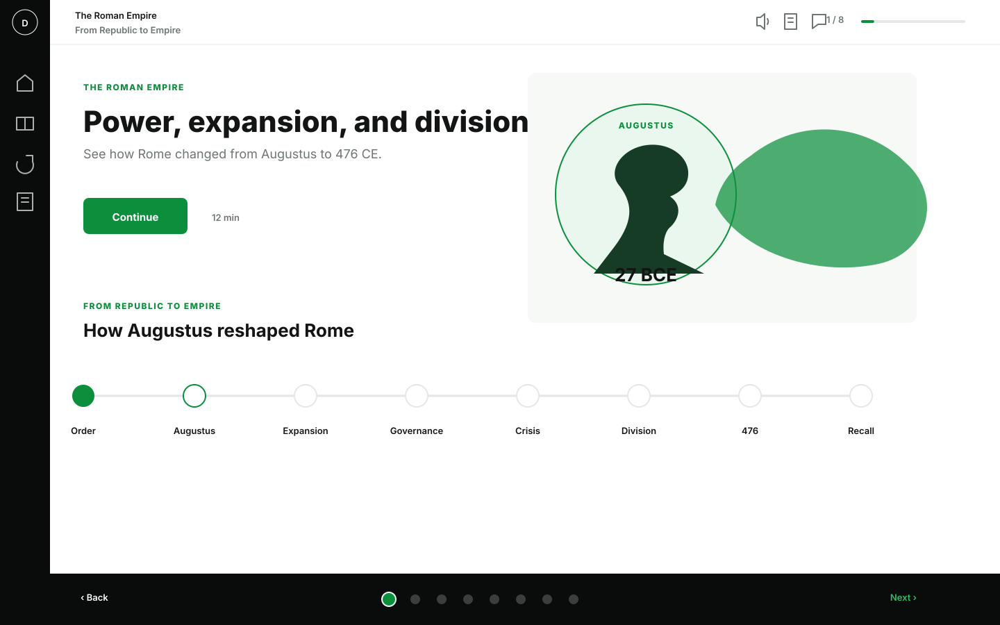
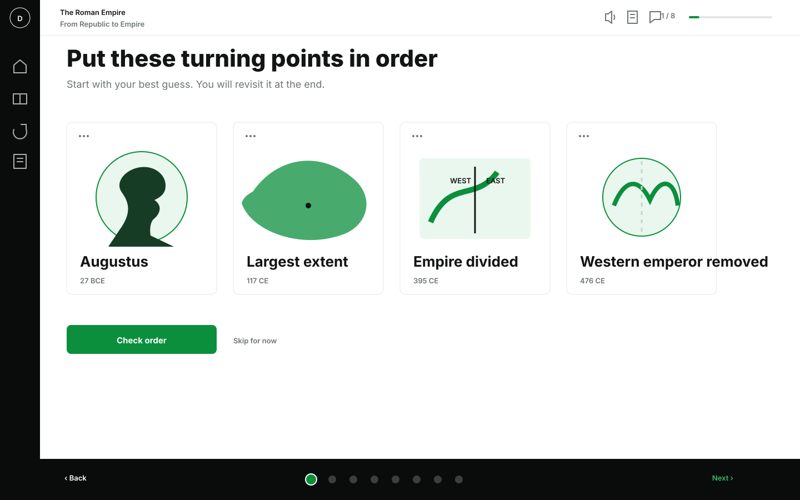
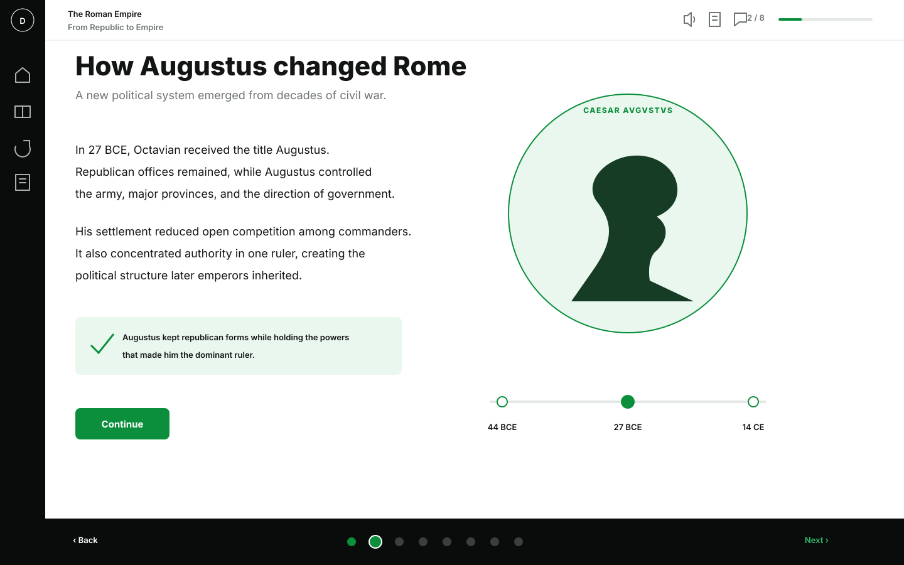
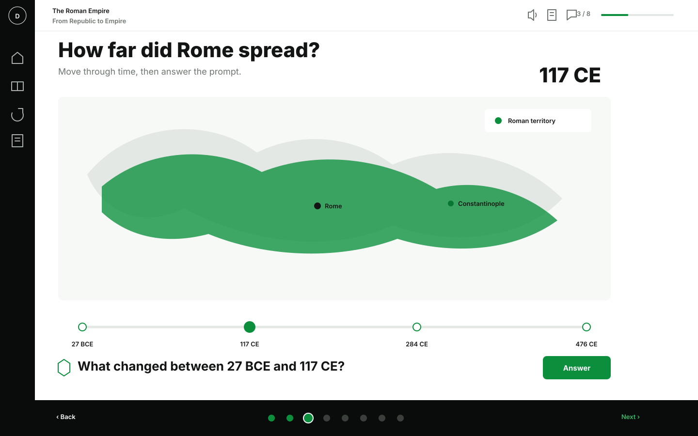
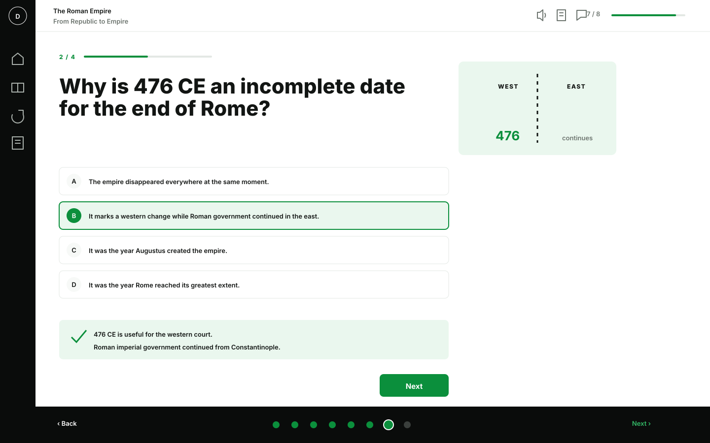
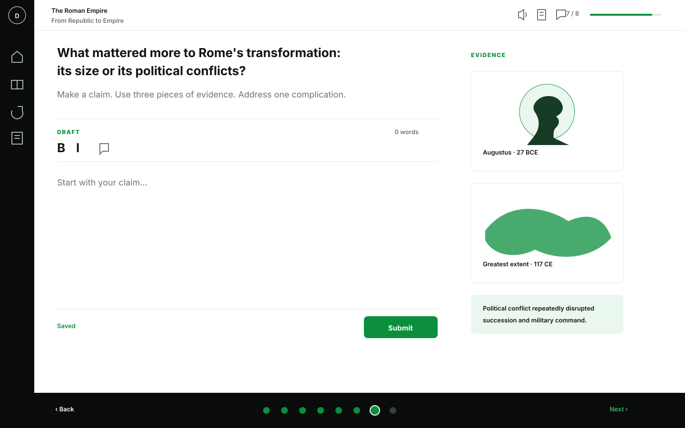
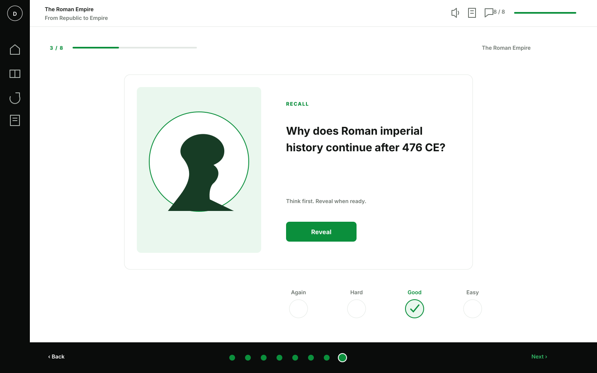

# Discere Recovery v2 — Reference Screens

These images are the approved implementation references for the Roman Empire reference lesson.

They are **separate full screens**, not sections of one dashboard.

## Primary references

### Course home

### Opening challenge

### Augustus explainer

### Expansion map

### Understanding check

### Essay studio

### Review card

## What these references control

- composition
- visual hierarchy
- information density
- white, black, and green palette
- icon placement
- picture-to-text balance
- border restraint
- progress treatment
- desktop proportions
- visible copy

## Information-economy rule

Do not repeat what the interface already communicates.

Examples:

- The review card does not need a heading that says `Flash cards / spaced review`.
- The question screen does not need both `Quiz` and `Check your understanding` above the question.
- The essay screen does not need `Essay topic`, `Write`, and `Submit` as stacked headings.
- The explainer does not need a large heading that says `Explainer`.
- Course, lesson, and stage names should each appear once.

Use icons, imagery, layout, and progress to provide context. Use words for the subject and the learner's action.

## Historical visual authority

The vector art in these SVGs is a layout reference. Production maps and historical images must come from reviewed deterministic data or licensed museum/archive/open-media sources.

## Required Sol gate

Sol should implement only the first four references initially:

1. course home
2. opening challenge
3. Augustus explainer
4. expansion map

It must capture desktop, tablet, and mobile screenshots and stop for approval before implementing the remaining screens.
